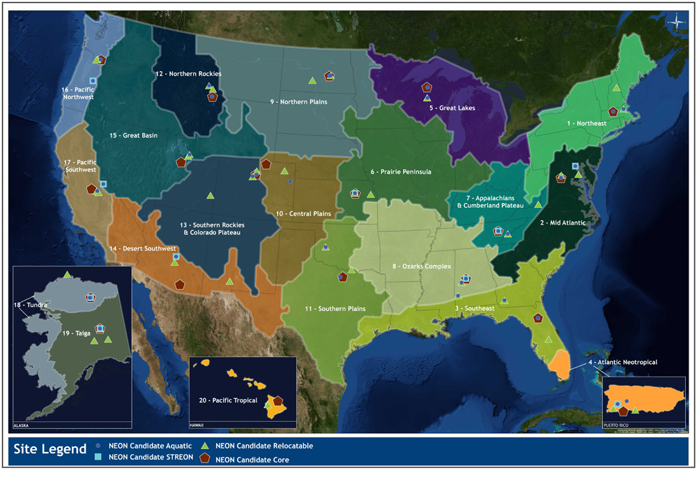
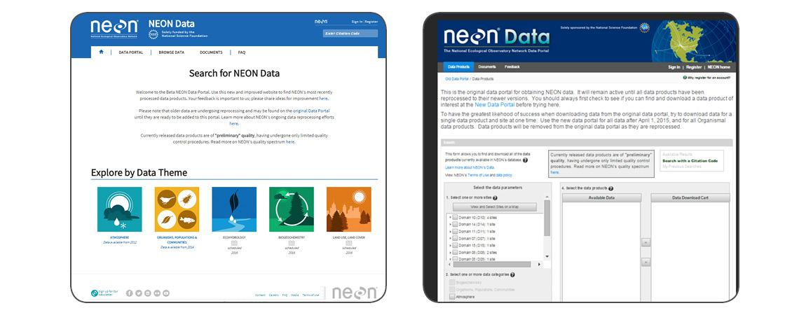

```{r setup, include=FALSE}
knitr::opts_chunk$set(echo = TRUE)
```

## National Ecological Observatory Network (NEON)
NEON is a continental-scale ecological observation facility, sponsored by the National Science Foundation. NEON collects and provides data that characterize and quantify complex, rapidly changing ecological processes across the United States. The comprehensive data, spatial extent and remote sensing technology provided by NEON will enable a large and diverse user community to tackle new questions at scales not accessible to previous generations of ecologists.

\

http://www.neonscience.org/


## Measuring the causes and effects of environmental change
The NEON observatory is designed to collect high-quality, standardized data from 81 field sites (47 terrestrial and 34 aquatic) across the United States. Data collection methods are standardized across sites and include in situ instrument measurements, field sampling and airborne remote sensing. Field sites are strategically selected to represent different regions of vegetation, landforms, climate, and ecosystem performance. NEON data and resources are freely available to enable users to tackle scientific questions at scales not accessible to previous generations of ecologists.



## NEON Assignment
Your last mystery data assignment will be self-driven. You are tasked with exploring the National Ecological Observatory Network's (NEON) data portal and downloading a data set of interest.  

\

http://data.neonscience.org/home

\

We will be given a tutorial by the science educator at NEON, Dr. Megan Jones. Dr. Jones will also be added to our slack message board for the assignment period. NEON has developed an R package to help condense the data product you download into a usable format. 

\

Be strategic about your data search! First, make sure you choose something that you find interesting. Then make sure you can have enough data to complete the assignment, but not so much that it becomes unwieldy.  For example, you may want to look at a certain data product across sites and/or years. Choosing different sites to make ecosystem comparisons is a good idea, but you likely don't need every possible available site. 



## April 24^th^
At our next scheduled lab session I will meet with you individually.  At this point, you must have selected and downloaded you chosen data set. We will informally discuss what you would like to investigate. In order to maintain reproducibility, I will collect your formatted data set before lab is finished. Any last minute changes must be completed before you leave the lab.

\

**Feel free to meet with my earlier to get the 'ok' on your data choice. This would allow you to get a head start on the assignment. It is not an excuse to skip the lab because we will also be meeting with GCI groups.**

## Assignment

This assignment will be quite open-ended. The grading rubric will be the same but the assignment is worth 30 points instead of 20 points. You now have all necessary skills to manipulate, visualize and interpret the data. **I would like a minimum of 4 figures.** Use visualizations and interpretation to succinctly address your approved ecological question. Your assignment will also need a brief introduction to cover the data type, coverage and methodology. I will obviously be available to help you along the way. Please turn in a markdown file of your assignment no later than 5pm on May 4^th^ 2018.

\

*Remember that the colloborative nature of previous assignments is not an option here. As such, waiting till the last minute would be a very poor decision.*

## R package to format NEON data
Your downloaded data will be a series of individual csv files and metadata. Possibly, quite a few of them. From the data portal your data sets will be downloaded as a zip file.  NEON has created a nice R package to combine these csv files into a master data set. It requires a package that is not available on CRAN (meaning you can't just select it in Rstudio). Below is a tutorial link

\

http://www.neonscience.org/neonDataStackR

\

When you have your zip file in your folder, use the code in the the download_neon.R script (provided) to format you files. The function stackByTable() joins the month-by-site files from a data download. The output will yield data grouped into new files by table name. 

\
Once completed, you will have a unzipped folder (of the same name) in the same directory as the zipped file. When you open this you will see a new directory called stackedFiles. This directory contains one or more .csv files (depends on the data product you are working with) with all the data from the months & sites you downloaded. There will also be a single copy of the associated variables.csv and validation.csv files, if applicable.

\

You will now have a a usable data product for you assignment. This data set is what you will give to me. Refer to the user guide (pdf) that is included in your download files to help write your introduction. 

## NEON information
Recent Article Using NEON Data: 

\

Original Article: https://onlinelibrary.wiley.com/doi/pdf/10.1111/ecog.03641

\

NEON write up: http://www.neonscience.org/observatory/observatory-blog/neon-data-yield-insights-links-between-climate-traits-species-richness