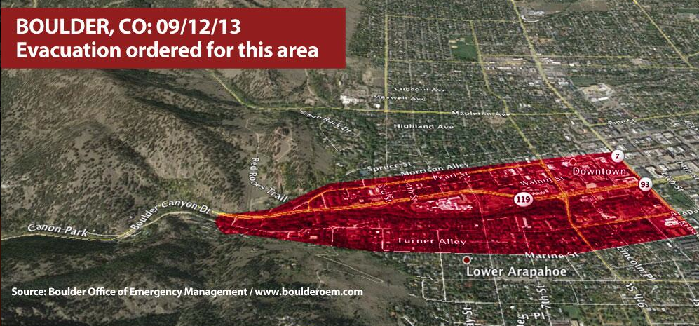

```{r setup, include=FALSE}
knitr::opts_chunk$set(echo = TRUE)
```


```{r,  fig.cap = "flood", fig.width = 6, fig.height=4}

```


https://www.zevross.com/blog/2017/06/19/tips-and-tricks-for-working-with-images-and-figures-in-r-markdown-documents/
