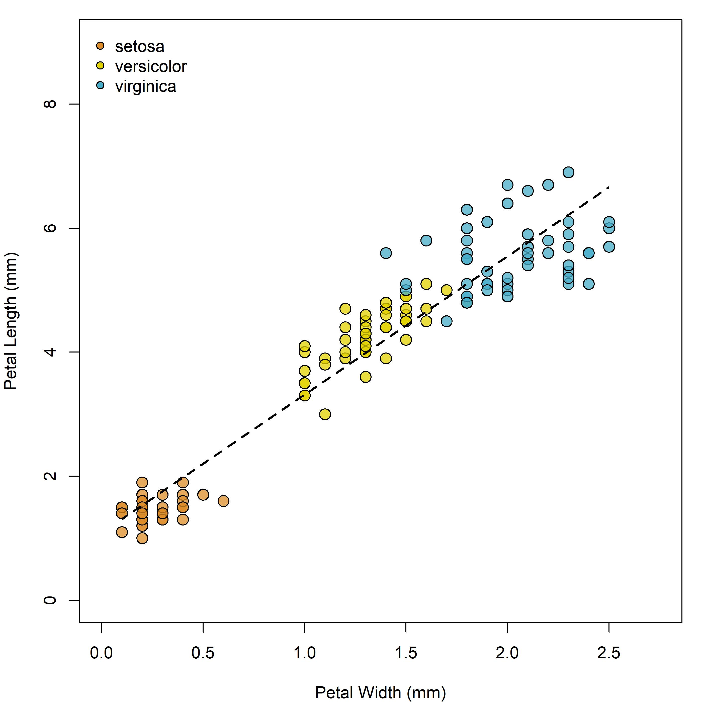

```{r setup, include=FALSE}
library(knitr)
opts_knit$set(root.dir = '../')
#this is what a code chunk looks like. 
#Here, I have loaded the knitr package and also added a neat trick that
#lets me read files outside of my markdown folder
```

# Introduction to Rmarkdown

This is an R Markdown document. Markdown is a simple formatting syntax for authoring HTML, PDF, and MS Word documents. For more details on using R Markdown see <http://rmarkdown.rstudio.com>. . The knitr package (as used by RStudio) will take a markdown-formatted text file and produce nicely-formatted output. Go ahead and install it if you dont have it. Thats is really all you need to know.

## Here are the basics for typing in a markdown file

You can do all normal typing operations in this file. See the use of hashtags for headers and subheaders. They look 'alright' as a html output, but look nicer if you output a word document. Once we render this document you will have a really ugly word document as an output.  This simple markdown is just forus to practive how it works. I will show you how to 'steal' the style formatting of a existing word document (appropriate header, colors, line spacing, etc).  

Once you get the hang of it, you wont have to point and click you mouse everyting you want to make a ~subscript~ or a ^superscipt^. **How cool is that!**. Just for fun, you should know that my spirit animal is a *Enhydra lutris*.  

There are a few ways to make a line break. You will need to tell knitr when these need to occur.  The first is to to end a sentence with two or more spaces plus return.   

Another way, which is more visual, is to use return + backslash.  I like this way because I can see it. The spacing is slightly different, so just choose one.

\

To be honest that is really all you need to know to get started. **Pretty dang easy**!. There are a lot additional steps to actually produce a journal article, but that will be covered in the next markdown tutorial. If your typing is as bad as mine, dont freak out, you can check spelling in the 'Edit' tab above.

## Code Chunks

If you are viewing this in RStudio you will see a grew box below.  This is called a 'code chunk'. Here we will place working code that performs a useful operation for us, that we can write text around.  Obviously, I mean that we can use code chunks to make figures and tables. We can give the code chunk options (e.g. echo=false), that only show the output (not the code) when we render the document.

\

```{r test}
summary(cars)
```

Lets breakdown code chucks. The chunk starts and ends with three accent characters, which are found left of the number keys. You can use this to make your own chunk...or...just click 'Insert' tab above and choose 'R'.  You can code everything inside the code chuck as normal. However, I usually have a seperate Rscript were I work out all the kinks of making the pretty figure. I dont like having to render the markdown over and over to look at a figure. This is more of the final product. The only important caveat is that all the scripts/data used in the code chunk need to be a one folder with the Rmardown files (not a big deal).

\
# Lets Review:

So we can write text, manipulate and analyze data and make figures in one place!!!!! You can setup the markdown file to output exactly like a scientific paper, including section headings, subheadings, title page, text, figures and even citations!! So you can make a full report/assignment/paper in one place, for free, with the most commonly and accepted software.

* Markdown lets you combine code and text
* You can output the most used formats
* Rmarkdown >= Word + Sigmaplot + SPSS/SAS + Endnote/Zotero/Mendeley
* **WOW!!!**


## Figures

What is really nice is that you can harness the power of R projects to make figures in many ways. You could obvisouly read the data, work with it and plot it directly in the code chunk. See below. Note that the `echo = FALSE` parameter was added to the code chunk to prevent printing of the R code that generated the plot. I also added message and warning = FALSE to suppress unwanted printed messages. For example, loading packages often prints a message about the version #.  Although informative, you dont want than printing in your manuscript.

```{r flowers, echo=FALSE, message=FALSE, warning=FALSE}
#read data
flowers <- iris

#simple linera model:
petal_mod <- lm(Petal.Length ~ Petal.Width, data=flowers)

#plot bits:
library(scales)
library(wesanderson)
library(plotrix)
mycols <- wes_palette("FantasticFox1", 3, type = "discrete")
mycols2 <- alpha(mycols, .75)
lengthlab <- "Petal Length (mm)"
widthlab <- "Petal Width (mm)"

#plot
par(mar=c(4,4,1,1))
plot(Petal.Length ~ Petal.Width, data=flowers, ylim=c(0, 9), xlim=c(0, 2.75),
     pch=21, bg=mycols2[Species], cex=1.5, ylab=lengthlab, xlab=widthlab)
ablineclip(petal_mod, x1=min(flowers$Petal.Width), x2=max(flowers$Petal.Width), lty=2, lwd=2)
legend("topleft", legend=levels(flowers$Species), pch=21, pt.bg=mycols, bty='n', inset=0.01)
```

\

However, in our normal workflow we most often work first in a script.  This is where we read, tinker, analyze and plot figures. Usually we end up with a finished product.  If you are using a proper workflow: **One script per task**, we can use source("filepath") to just run our script in the code chuck.

```{r flowers2, echo=FALSE, message=FALSE, warning=FALSE}
#just run the figure script

source("rmarkdown_tutorial/flower_figure.R")

```

\

Thats not it either.  Often you need to produce figures of a certain file type, such as png, jpeg, tiff, pdf, etc.  R conviently allows you to make all of these.  Refer back to manual or Google for whichever ones we havent covered. Open the flower_figure script and see where I have added some code where I produced this figure as a jpeg and saved it in the output folder. You can do several nice things here. First we can run the above code and set the actual type of plot we want to render. There are lots of options for sizing and quality. 

```{r flowers3, echo=FALSE, message=FALSE, warning=FALSE,fig.width=7, fig.height=7, echo=FALSE,  dev="png", dpi=600}
#just run the figure script

source("rmarkdown_tutorial/flower_figure.R")

```

We can also just insert a premade figure as an image. This is proabably not the best option, but it works.

```{r flowers4, echo=FALSE}
#just insert the image using afunction in the knitr pacakge



```

## Make your own image with the built in ChickWeight dataset

For practice, lets make a figure and/or a summary of one of the built in datasets in R.  In the console, type data() to find the dataset investigating weight vs age of chicks on different diets. In the tabs above, click insert and choose 'R'. This will place a code chunk below.  Make sure and give the code chunk a name and think/play with the code chunk options.  Practice visualizing the ChickWeight data with the code options avaiable. Make sure and first save the dataset as an object in your global environment. Use this also as practice to tidy up your plotting skills.

\

In a new code chunk below visualize the mean weight of each diet (n=4) through time.  **HINT** You will have to obtain the the means on your own. As you will have to explore the dataset, it makes sense to start a script first. Below the code chunk, type a figure caption as you would in a manuscript.

```{r}
chicks <- ChickWeight

chicks_means <- doBy::summaryBy(weight ~ Time + Diet, data=chicks, FUN=mean,
                                keep.names = TRUE)

plot(weight ~ Time, col=Diet, data=chicks_means)

```
Figure 1.
